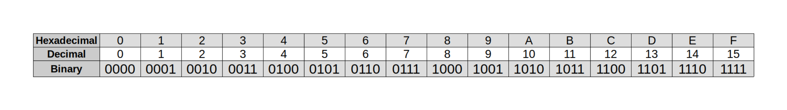
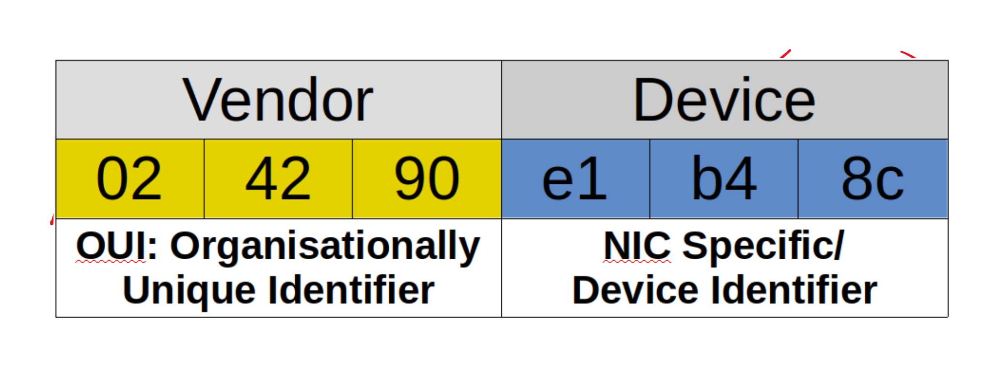
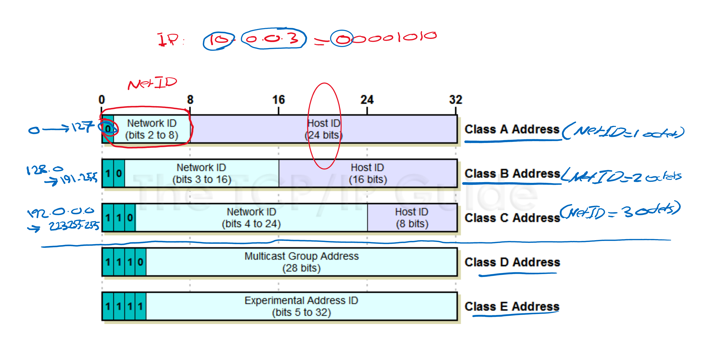
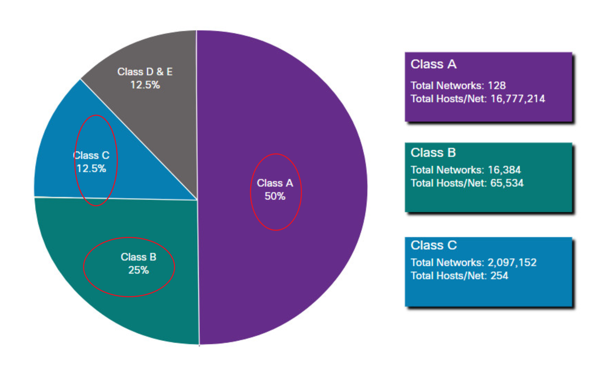

# Binary

Base16 hexadecimal

https://www.rapidtables.com/convert/number/decimal-to-hex.html

# Mac address

* 48 bits total
* hexadecimal binary

# IP address (Internet protocol)

### Classful IP

Two types IPv4 and IPv6

32 bits, decimal, 4 octect

Hosts =

Class A 2^24

Class B 2^16

Class C 2^8
*How each class address is formed*

*Image to display the total number of networks & hosts  each class has* 

### ClassLess IP 

The use of subnet mask allows for a classless IP range
- Less Wasted hosts/network IPs 
- More control of the exact number of Hosts on each subnet

### Private Address
Class A:

    - 10.0.0.0 -> 10.255.255.255 
Class B:

    - 196.254.0.0 -> 196.254.255.255
    - 172.16.0.0 -> 172.31.255.255
Class C:

    - 192/168.0.0 -> 162.168.255.255
### Special Address

    127.0.0.1 -> 127.255.255.255

## Packet Tracer

*Ping* is a tool that replies on a protocol called: 

    ICMP (Internet Control Message Protocol)

ARP: Address Resolution Protocol

    Used to find the MAC address of an IP address of the network

Default gateway

    A default gateway servers as the forwarding host to other networking when 
    no other route is specification matches the destination IP address 
