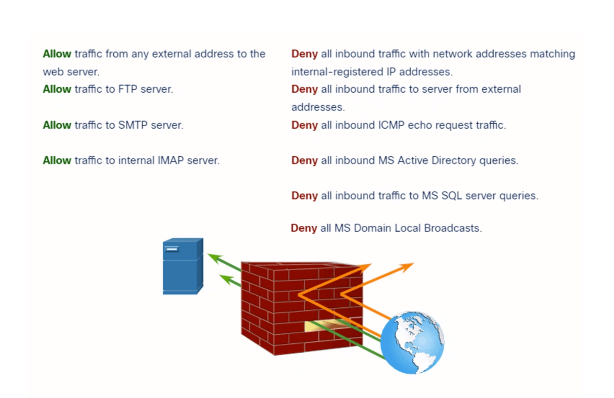

# Firewalls
- A system or group of systems that will enforce an ACL 
- Can be either a software or hardware
- IF it is a sofwtare can be installed on any end host

### ACL 
    - Allows you to configure to allow or deny access traffic
    - Contains the rules that grants or deny access to a certain devices/network
## Types of firewalls
### Packet filtering firewall 
    Control network access by analyzing inbound and outbound traffic 
    Based on transport 4 and network 3 layer
    Check Destination and Source IP address and TCP/UDP ports

### Application Gateway Firewall 
    Able to do everything of a packet filterign firewall 
    Will also check the application data 

## De-militarised zone DMZ
    Networking equalite boarder control
    Allow the public network to access it to use the services 