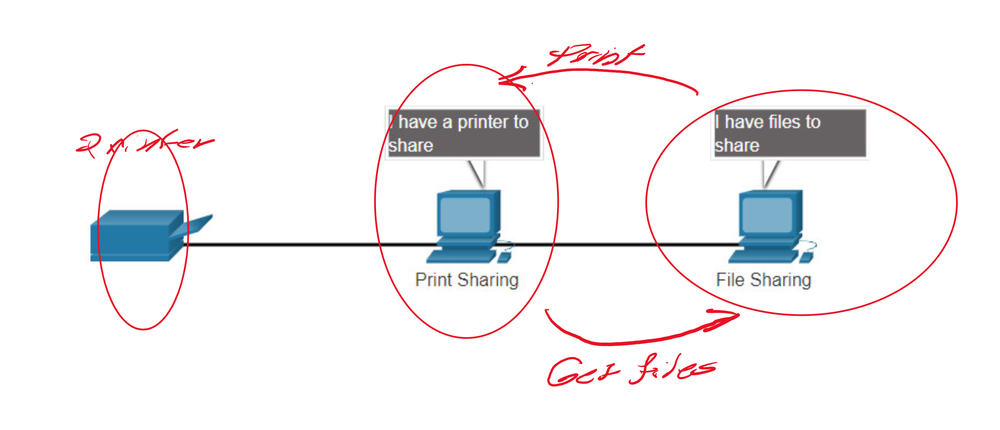
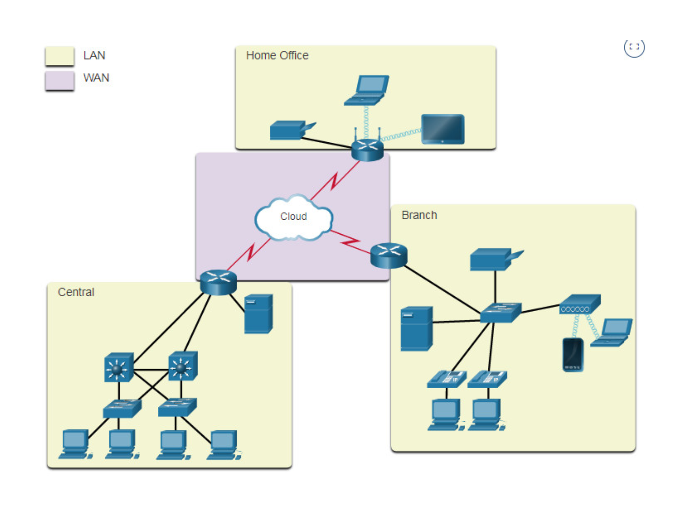
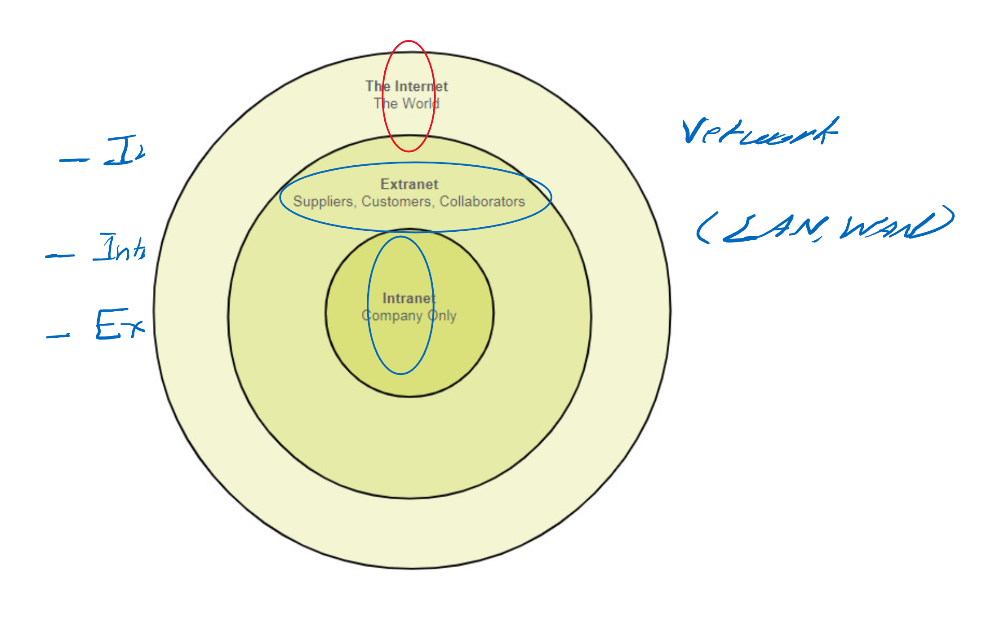

# Basics of Networking

Host/End device 
- Any device that is assigned a address from the network

Servers 
- Computer with softer that allows you to provide a service to other devices

Client
- Computer that requires a services

Peer to peer connection  
- Both can ask services from each other neither is a client nor servers

#### Intermediary devices
  
In the network only to connect the end devices to the network:
  
 
    - Wireless router
    - Lan Switch Router
    - Multilayer switch
    - Firewall Appliance

# Network media

- Metal Wires (cable) – any cable used
- Fibers
- Wireless

# Network Type

Might categories the network type depending on the following:

    - Size of the area covered.
    - Number of uses connected.
    - Types of services
    - Area of responsibility

# Network Infrastructure types

Lan - Local area network

Wan – Wide area network

Man – Metropolitan area network

Internet
- A public connection of WANs and LANs

Intranet
- A private collection of WANs and LANs for one organization

Extranet
- A private connection between two organisations 

# Communications Elements

- Source /Sender
- Destinations /receiver
- Channel

# Message Delivery Options

- Unicast
  - Sending to only one destination
- Multicast
  - Sending the message to more than one destination
- Broadcast
  - Sending a packet to everyone on the network