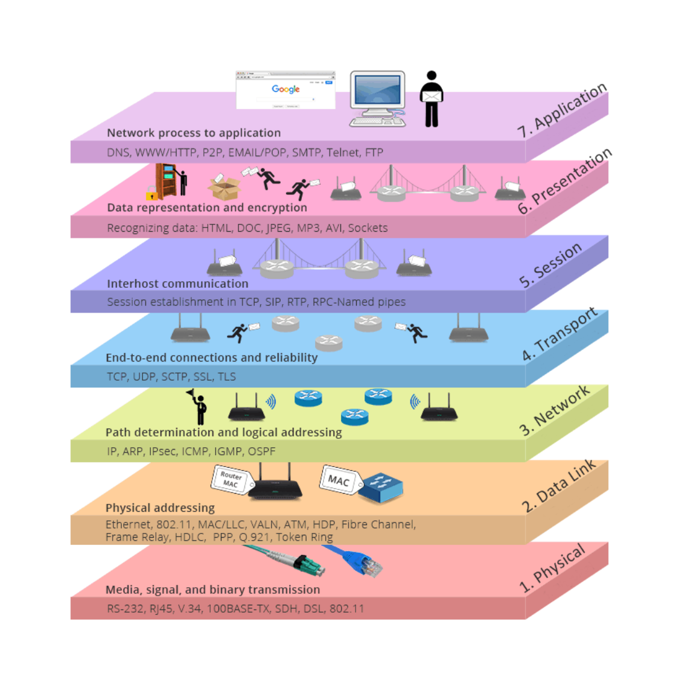

# Protocol sweep

*OSI* (Open System Interconnection model) Layers

Development by ISO and ITU

### TCP/UDP User datagram protocol 

### TCP (Transmission Control Protocol) IP layers 

### Encapsulation 

# Port

    Uses port numbers to run different services simultaneously
    
    Network port is a location where information is sent
    
    IANA (Internet Assigned Number Authority) the people that decide what port is used for what

0 – \&gt;1024 – Well known ports

1024 -\&gt; 49151– common application

49151 -\&gt; 65535 - Dynamic ports

**Well-Known Port Numbers**

| **Port Number** | **Protocol** | **Application** |
| --- | --- | --- |
| 20 | TCP | File Transfer Protocol (FTP) – Data |
| --- | --- | --- |
| 21 | TCP | File Transfer Protocol (FTP) – Control |
| 22 | TCP | Secure Shell (SSH) |
| 23 | TCP | Telnet |
| 25 | TCP | Simple Mail Transfer Protocol (SMTP) |
| 53 | UDP, TCP | Domain Name Service (DNS) |
| 67 | UDP | Dynamic Host Configuration Protocol (DHCP) – Server |
| 68 | UDP | Dynamic Host Configuration Protocol – Client |
| 69 | UDP | Trivial File Transfer Protocol (TFTP) |
| 80 | TCP | Hypertext Transfer Protocol (HTTP) |
| 110 | TCP | Post Office Protocol version 3 (POP3) |
| 143 | TCP | Internet Message Access Protocol (IMAP) |
| 161 | UDP | Simple Network Management Protocol (SNMP) |
| 443 | TCP | Hypertext Transfer Protocol Secure (HTTPS) |

# Bandwidth

The amount of data that can be transmitted per second in a network